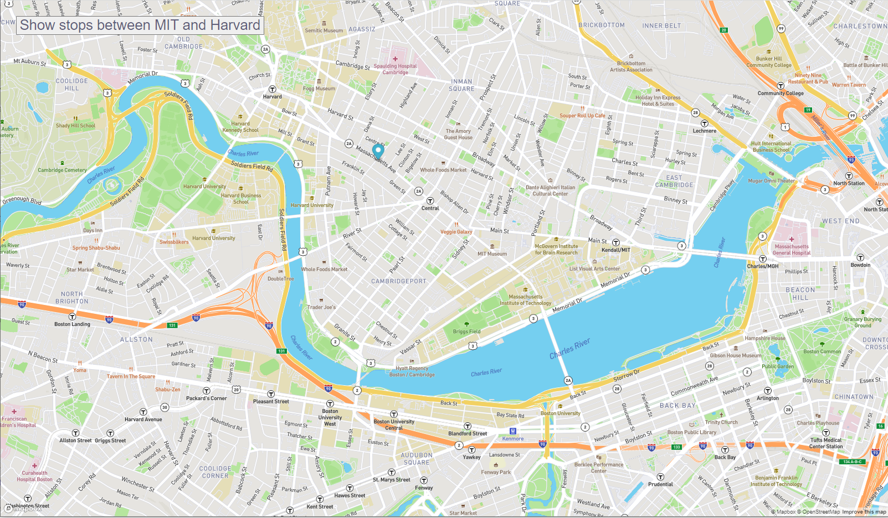

# Real-Time-Bus-Tracker
In this activity we are using the MBTA (Massachusetts Bay Transportation Authority) bus data to determine Bus stops between Harvard and MIT. An animated marker is added to the map that highlights the bus tops. The marker moves at a Set Time.

# Description:
This excercise was about creating a custom map using mapbox( open-source paltform to create and display maps on a web page) for all bus stops between MIT & Harvard.
A marker was added to a specific location. A move() function was written that is called when the button "Show stops between MIT and Harvard" is selected.
At a set timeout of 2secs the marker moves from one bus stop location to the next on the map.

# Improvements:
I updated the style sheet changing font-size and color
I changed the Timeout for the move() function to every 2secs

# How to Run:

You need an accessToken which you can get my creating an account on mapbox

You can download the 3 files from this repository
  -mapanimation.js
  -index.html
  -styles.css
 
 You can use these files as a base line and make changes and create your own custom map. You can open the index.html on your browser window to see it work.
 

# Roadmap of future improvements: 
I would like to create a tool tip, that when I hover over the marker it gives me an address for the bus stop as well
